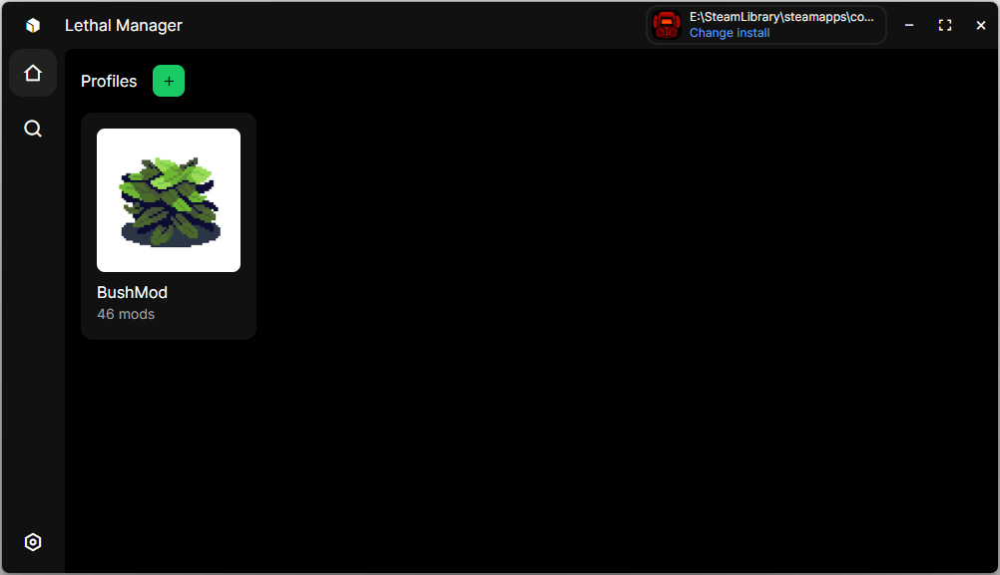
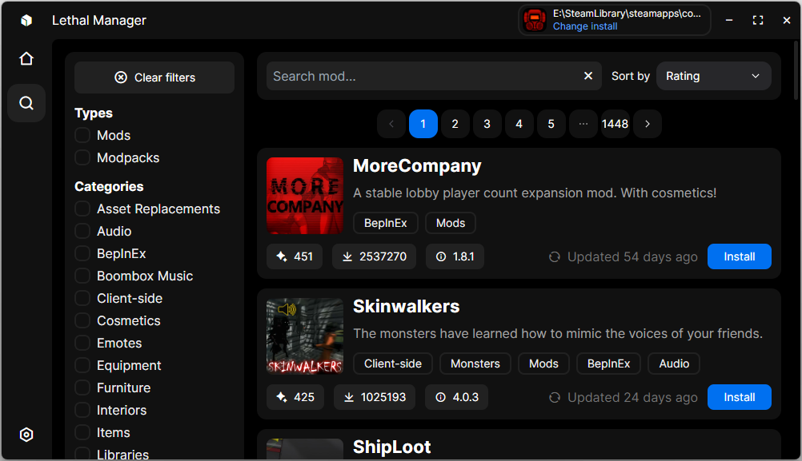

# Lethal Manager
Lethal Manager is a mod management tool designed for Lethal Company, inspired by the popular [Modrinth](https://modrinth.com/) platform.

## Features
- Supports game installations from any location, including Steam
- Allows creating and managing profiles with custom mod sets
- Provides a search tool for mods from the Thunderstore website

## Screenshots

## Todo
- [ ] Export/Import profiles
- [ ] Import profiles from Thunderstore
- [ ] Modify BepInEx configurations
- [ ] Settings
- [ ] Mod Info

## Installation
To install Lethal Manager, visit the [releases page](https://github.com/danisty/LethalManager/releases) and download the latest version.

## Contributing
To contribute to Lethal Manager:
1. Clone the repository
2. Run `cargo tauri dev` or `testing.bat`

## Building
To build Lethal Manager from source:

1. Clone the repository
2. Run the appropriate command/file:
  - Release build: `cargo tauri build` or `build-release.bat`
  - Debug build: `cargo tauri build --debug` or `build-debug.bat`
